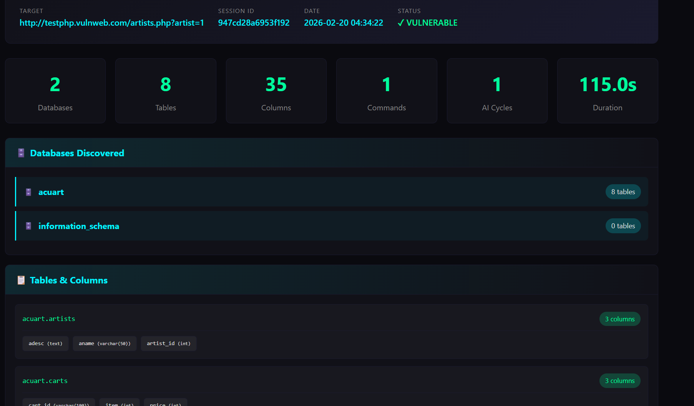
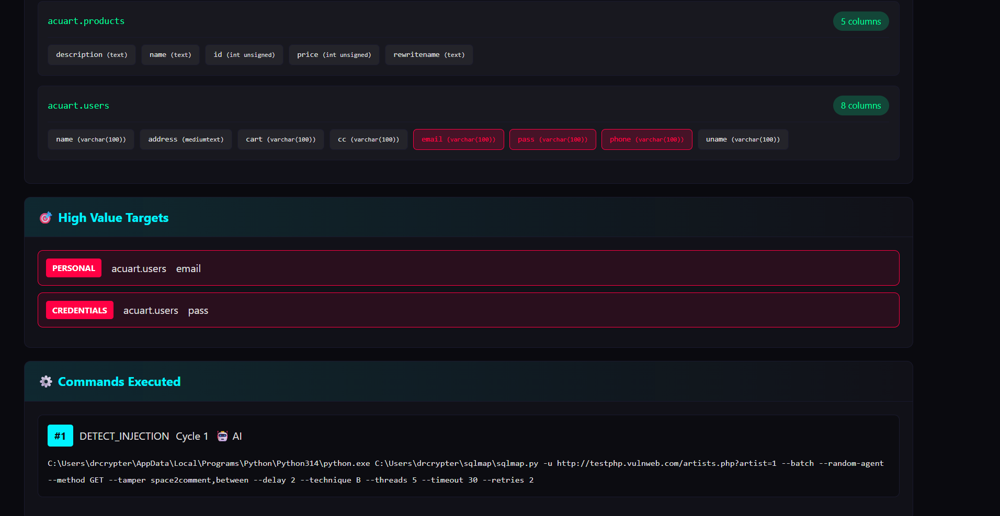

## 🚀🧠 SKYNET SQLMap — Launching in 24 Hours

A modern **SQLMap Autonomous by AI** offensive/defensive assistant with a clean Web UI, smart automation, and real-time reporting.

✨ **Key Features (Short)**
- 🤖 **AI-assisted scanning** (smart hints, payload guidance, triage notes)
- 🚀 **Mass-SQL Injection** (One Click and AI will holding your to SQL Injection and Bypass WAF Method by SQLMAP Options)
- 🧪 **SQLMap orchestration** (GET/POST/cookies/headers, session handling)
- 🖥️ **Neon Web Dashboard** (targets, progress, DBs/tables/dumps stats)
- 📂 **Just view Results with details** (from `sqlmap-report` folder based on format style with html or json and txt)
- 🔔 **Telegram/Discord Alerts** (success hits + key evidence)
- 🧵 **Threading & Stability** (better queue + retry + verbose debug `-debug`)

### 🖼️ Screenshots

