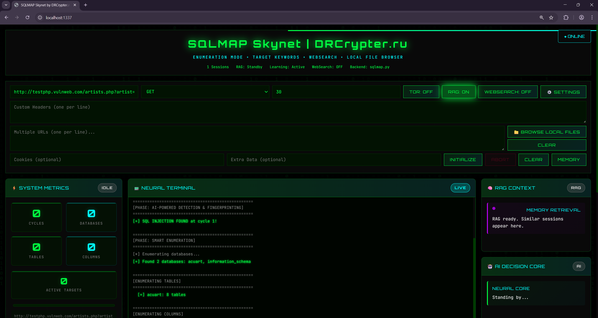
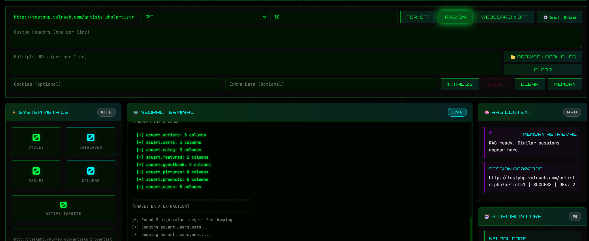
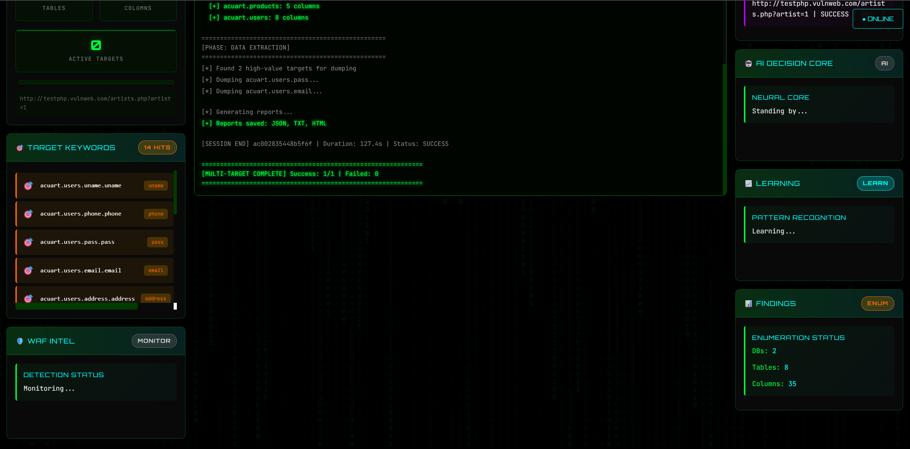
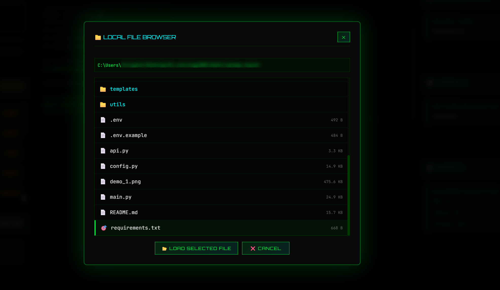
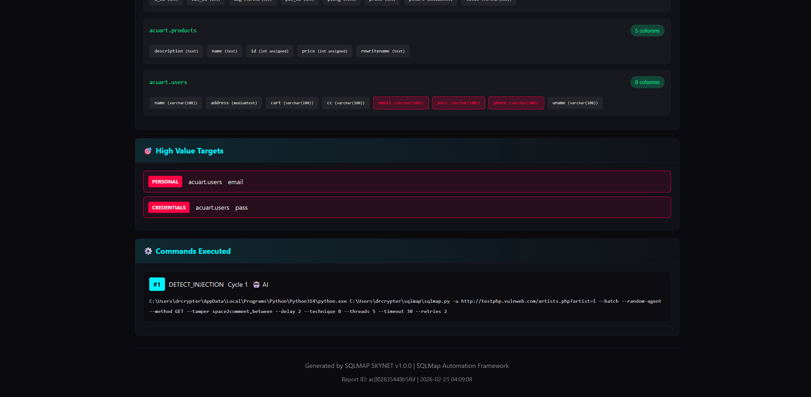
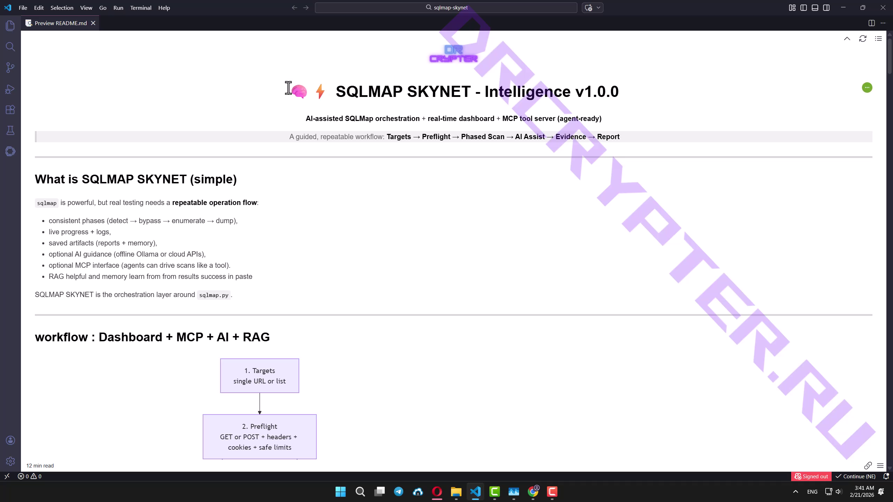
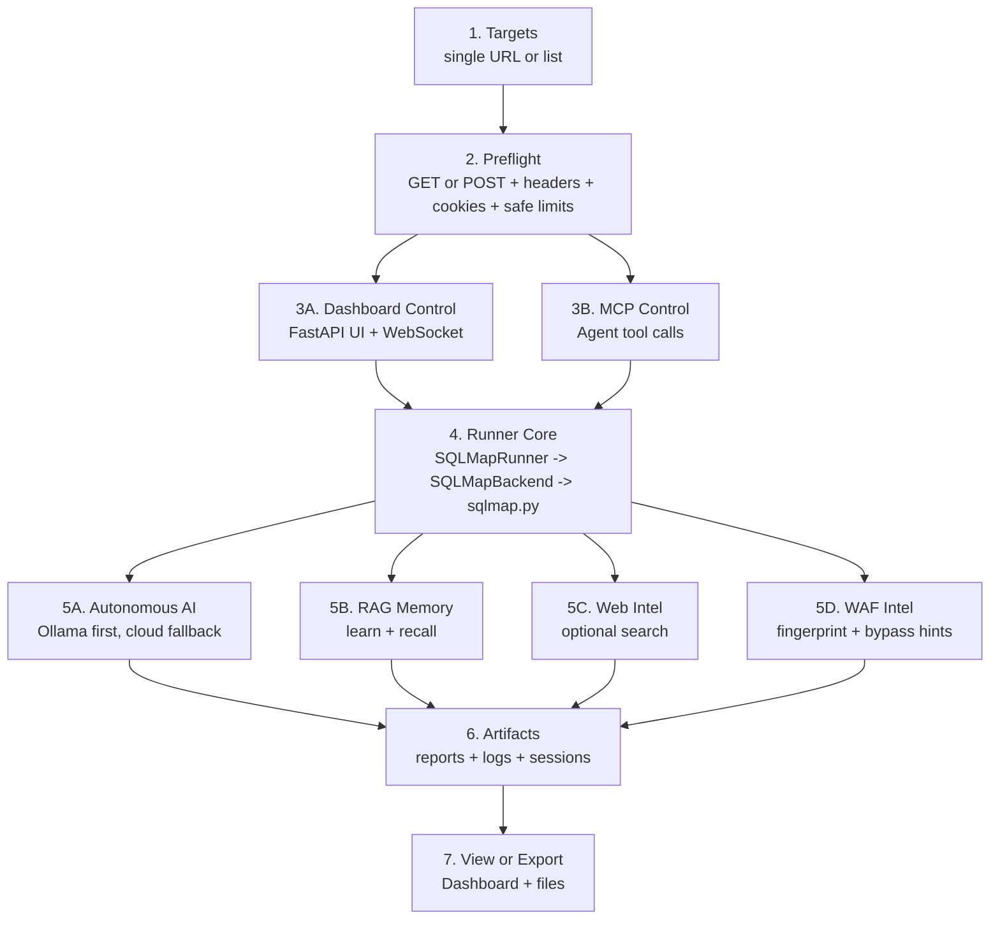
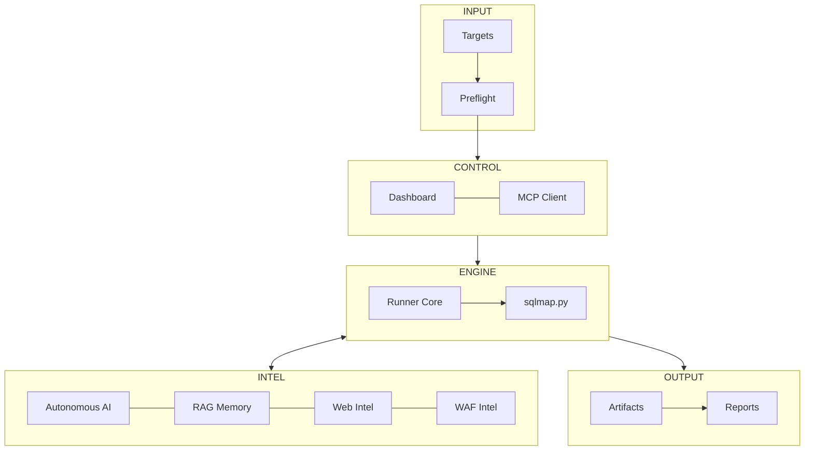

<!-- ============================= -->
<!--         SQLMAP SKYNET         -->
<!-- ============================= -->

<div align="center">

  # 🧠⚡ SQLMAP SKYNET - Intelligence v1.0.0

  

  **AI-assisted SQLMap orchestration** + **real-time dashboard** + **MCP tool server (agent-ready)**

  > A guided, repeatable workflow: **Targets → Preflight → Phased Scan → AI Assist → Evidence → Report**
 
   
</div>
---

## What is SQLMAP SKYNET (simple)

**SQLMAP SKYNET** wraps **`sqlmap.py`** with a **Neural Ops workflow** — fast, structured, and trackable.

- ✅ **Operational phases** (Detect → Bypass → Enumerate → Dump)
- ✅ **Dashboard visibility** (logs, stats, artifacts)
- ✅ **Autonomous AI tuning** (Ollama / Cloud)
- ✅ **RAG intelligence** (learns from success, recalls patterns)
- ✅ **MCP tool server** (agent automation)

**Goal:** higher signal, less noise, and reports real proof.

## 📸 Screenshots of Feature 
<table>
  <tr>
    <td></td>
    <td></td>
  </tr>
  <tr>
    <td></td>
    <td></td>
  </tr>
</table>

## 🧾 Report Samples

<table>
  <tr>
    <td></td>
    <td></td>
  </tr>
</table>

## 🎥 Demo Video

[](https://t.me/burnwpcommunity/12026)


---

## workflow : Dashboard + MCP + AI + RAG



### Neural Ops Stack (Simple)


**Key idea:** MCP and Dashboard are two ways to drive the same engine logic:
- Dashboard = human operator UI  
- MCP = agent/tool interface

---

## Windows requirements (choose your AI mode)

### ✅ Minimum (no local AI)
- Windows 10/11 64-bit
- Python **3.12+**
- Git
- `sqlmap.py` present (recommended: `.\sqlmap\sqlmap.py`)
- Any CPU / 8GB RAM

Use **Cloud AI** (OpenAI / Groq / DeepSeek / Kimi / Claude) or run with AI features OFF.

### ✅ Recommended (local AI with Ollama)
- Windows 10/11 64-bit
- Python **3.12+**
- **16GB RAM** (recommended)
- GPU optional (faster with Nvidia GPU + VRAM)
- Ollama + **Llama 3.2** model (`llama3.2:latest`)

> Tip: Llama 3.2 in Ollama has small variants (1B/3B). If your PC is weak, local AI still works — just expect slower responses.

---

## Table of contents
- [Install & setup (Tested on Windows)](#install--setup-on-windows)
- [Install sqlmap.py](#install-sqlmappy)
- [Install Ollama + Llama 3.2](#install-ollama--llama-32)
- [Run SKYNET dashboard](#run-skynet-dashboard)
- [First scan tutorial](#first-scan-tutorial)
- [Enable MCP server (agent mode)](#enable-mcp-server-agent-mode)
- [Cloud AI setup (if your PC is weak)](#cloud-ai-setup-if-your-pc-is-weak)
- [Config power tips (config.py)](#config-power-tips-configpy)
- [Full project structure map](#full-project-structure-map)
- [Artifacts](#artifacts)
- [Community & Resources](#community--resources)
- [🤝 Contributing](#-contributing)
- [📜 License](#-license)
- [⚠️ Disclaimer](#-disclaimer)

---

## Install & setup (Tested on Windows)

### 1) Clone project
Open **PowerShell**:

```powershell
git clone <YOUR_REPO_URL> sqlmap-skynet
cd sqlmap-skynet
```

### 2) Create venv (required)
```powershell
py -3.12 -m venv .venv
.\.venv\Scripts\Activate.ps1
python --version
```

### 3) Install Python dependencies
```powershell
pip install -U fastapi uvicorn python-dotenv aiohttp requests numpy scikit-learn
```

Optional (for MCP server over HTTP):
```powershell
pip install -U fastmcp
```

### 4) Create `.env`
```powershell
Copy-Item .env.example .env
```

Open `.env` and set what you need:
- Local AI: Ollama (recommended)
- Or Cloud AI keys (if PC is weak)

---

## Install sqlmap.py

Best practice (inside project folder):

```powershell
git clone https://github.com/sqlmapproject/sqlmap.git sqlmap
```

✅ You must have:
```text
sqlmap-skynet\
  sqlmap\sqlmap.py
  main.py
  config.py
  ...
```

---

## Install Ollama + Llama 3.2

### 1) Install Ollama (Windows)
- Download & install Ollama for Windows from the official site.
- After install, open a new PowerShell and verify:

```powershell
ollama --version
```

### 2) Pull the model used by SKYNET (default)
Your `config.py` sets:
- `OLLAMA_MODELS['default'] = 'llama3.2:latest'`

Pull it:

```powershell
ollama pull llama3.2:latest
```

Test:

```powershell
ollama run llama3.2:latest
```

> If you want to switch model later, edit `config.py` under `OLLAMA_MODELS`.

---

## Run SKYNET dashboard

Start the server:

```powershell
python main.py --host 0.0.0.0 --port 1999 --debug
```

Open:
- Dashboard: `http://127.0.0.1:1999`

---

## First scan tutorial

> Use a target you own / have permission to test.

### Step 1 — Add targets
In the dashboard:
- Paste **one URL** or **multiple URLs** (one per line)

### Step 2 — Set method
- GET for query params
- POST for login/forms

### Step 3 — Add session context (optional)
- Headers (User-Agent, Authorization)
- Cookies (session token)
- POST body (for POST scans)

### Step 4 — Start
Choose safe defaults:
- `max_cycles = 30`
- RAG = ON (recommended)
- Web Search = OFF (start simple)

Then click **Start**.

### Step 5 — Review
After the scan:
- Check `sqlmap_reports\`
- Check `memory\sessions\` (if RAG enabled)

---

## Enable MCP server (agent mode)

### What MCP does
MCP allows an AI agent to call SKYNET tools:
- `sqlmap_scan` → starts scan (uses `sqlmap.py`)
- `get_scan_status` → polling status/results
- `get_ai_providers` → shows available AI backends

### 1) Install MCP dependency (once)
```powershell
pip install -U fastmcp
```

### 2) Start MCP server over HTTP
Run in a new PowerShell (keep dashboard in another terminal if you want both):

```powershell
python -c "from mcp.server import mcp_server; mcp_server.mcp.run(transport='http', host='127.0.0.1', port=8000)"
```

Your MCP endpoint:
- `http://127.0.0.1:8000/mcp`

### 3) Confirm MCP tools
```powershell
fastmcp list http://127.0.0.1:8000/mcp
```

### Does MCP work with Autonomous AI?
✅ Yes. MCP tool `sqlmap_scan` creates `SQLMapRunner("sqlmap.py")`, and the runner uses `core/autonomous_ai.py`.  
So **MCP calls automatically use your Autonomous AI + RAG logic** (no module changes needed).

---

## Cloud AI setup (if your PC is weak)

If you can't run Ollama fast (low RAM/CPU), you can use Cloud AI.

### Quick setup
1) Open `.env`
2) Add ONE key (example OpenAI):

```text
OPENAI_API_KEY=YOUR_KEY_HERE
```

Other supported keys:
- `GROQ_API_KEY=...`
- `DEEPSEEK_API_KEY=...`
- `KIMI_API_KEY=...`
- `ANTHROPIC_API_KEY=...`

SKYNET will detect which providers are available and use them when needed.

> Provider priority is defined in `config.py` as `AI_PRIORITY`.

---

## Config deep guide (config.py)

`config.py` is the **brains + intel database** of SKYNET.  
If you want better results, **this is the first file to tune**.

> Tip: On GitHub you can click the file: **`config.py`** → then use the browser search (Ctrl+F) for the section names below.

### Quick map (what you can tune)
- ✅ **AI models** (Ollama model names)
- ✅ **AI provider priority** (Ollama first or cloud first)
- ✅ **WAF bypass packs** (delay/threads/tamper presets)
- ✅ **Tamper script database** (profiles by aggressiveness)
- ✅ **Technique priority** (faster signal, less noise)
- ✅ **Keyword intelligence** (High-Value Columns (Keyword Intel): Customize the keyword list to match your environment (examples: crypto, email, password, hash, token, apikey, secret). SKYNET will prioritize and highlight matching columns so you can identify impact faster.)

⚠️ For educational/authorized testing only. Use only on systems you own or where you have written permission.

---

### Click for full details (config.py)

<details>
<summary><b>1) OLLAMA_MODELS — local model selection</b></summary>

SKYNET reads the local Ollama model name from:

```py
OLLAMA_MODELS = {"default": "llama3.2:latest"}
```

**What to do:**
- Keep `llama3.2:latest` as default if it works well on your PC.
- If your PC is slow, use a smaller model (if you have it in Ollama) and set it here.

**Why it matters:** model choice affects speed + quality of AI plans.

</details>

<details>
<summary><b>2) AI_PRIORITY — which AI provider is used first</b></summary>

Example:
```py
AI_PRIORITY = ["ollama","deepseek","kimi","groq","openai","claude"]
```

**What to do:**
- Want offline-first? keep `ollama` first.
- Want cloud-first? move your cloud provider to the front.

**Why it matters:** the first available provider in this list is used most often.

</details>

<details>
<summary><b>3) REAL_WORLD_BYPASSES — WAF/Block presets (very important)</b></summary>

This section is like a “bypass playbook”.  
It stores presets for common conditions like:
- Cloudflare / Akamai / Imperva / Sucuri
- ModSecurity / AWS WAF
- Generic 403 / rate limiting / captcha pages

Typical preset contains:
- `delay` and timing
- `threads` (lower threads = less blocks)
- `tamper_scripts` (safe → aggressive)

**How SKYNET uses it:**
- if it detects blocking patterns (403, suspicious headers, WAF signatures),
  it can propose one of these presets automatically.

**Operator tip:**
- Start with low/no tamper + low threads.
- Increase only if you are authorized and you confirm WAF behavior.

</details>

<details>
<summary><b>4) TAMPER_SCRIPTS — tamper profiles (basic → aggressive)</b></summary>

Tamper scripts can help evade filters but they can also:
- slow scans
- increase false positives
- increase detection/noise

SKYNET organizes them into groups like:
- `basic`
- `moderate`
- `aggressive`
- `waf_specific`

**Best practice:**
- Use **basic** first.
- Use **moderate** only when blocked.
- Use **aggressive** only with permission + clear block evidence.

</details>

<details>
<summary><b>5) TECHNIQUE_PRIORITY — faster signal with less noise</b></summary>

This controls which SQLi techniques SKYNET tries to focus on first (depending on your logic).  
Typical techniques:
- Error-based
- Union-based
- Boolean-based
- Time-based

**Why it matters:**  
On many real targets, hammering time-based from the start creates slow scans + blocks.  
A good priority order can produce faster confirmation and cleaner results.

</details>

<details>
<summary><b>6) HIGH_VALUE_COLUMNS — keyword intel that improves result quality</b></summary>

This is one of the strongest “operator experience” features.

`HIGH_VALUE_COLUMNS` contains keywords like:
- `password`, `pass`, `hash`
- `email`, `phone`
- `token`, `apikey`, `secret`
- `session`, `cookie`
- `card`, `cc`, `billing`
- `admin`, `role`, `permission`

**How SKYNET uses it:**
- When enumeration finds many columns, SKYNET highlights likely high-value fields.
- This makes results easier to read and reduces time wasted on irrelevant tables.

**Customize it for your environment**
Add your own keywords, for example:
- HR: `employee_id`, `salary`, `department`
- Finance: `invoice`, `receipt`, `balance`
- E-commerce: `order_id`, `shipment`, `cart`
- Your apps: `telegram`, `line_id`, `customer_uid`

**Big win:** better keyword intel = faster identification of “real impact” in a report.

</details>

<details>
<summary><b>7) Other useful knobs you may have in config.py</b></summary>

Depending on your version, you may also see:
- default delays/threads limits
- retry policy / backoff
- request headers templates
- detection patterns / error signature lists
- file browser root restrictions

If you’re unsure: keep defaults and tune slowly.

</details>

---

### “More Advanced Feature and Config” (recommended way)
If you want users to click from README:
- Add a GitHub link in your repo to `config.py` (example):
  - `./config.py`
- In GitHub, it becomes clickable automatically.

Example you can paste anywhere in README:
```md
See: [config.py](./config.py)
```


## Full project structure map

```text
sqlmap-skynet/
├─ 🚀 main.py
│  └─ FastAPI dashboard server + WebSocket control + scan orchestration
├─ 🧠 config.py
│  └─ AI models + provider priority + WAF bypass packs + tamper DB + keyword intel
├─ 🧩 api.py
│  └─ (optional/legacy) stats endpoint helper (older Flask-based helper)
├─ 🧪 .env / .env.example
│
├─ 🛠️ scanners/
│  ├─ 🧭 runner.py
│  │  └─ Phase engine (detect → bypass → enumerate → dump) + session state
│  └─ 🧱 sqlmap_backend.py
│     └─ Builds and executes real `sqlmap.py` commands
│
├─ 🧠 core/
│  ├─ 🤖 autonomous_ai.py
│  │  └─ AI planner + provider health + JSON plan parsing
│  ├─ 🧬 rag_memory.py
│  │  └─ Store/recall session intelligence (learn from past scans)
│  ├─ 🧾 report_generator.py
│  │  └─ Build artifacts/reports from results
│  ├─ 📡 state_manager.py
│  │  └─ Shared runtime state (running/progress/results)
│  ├─ 🛡️ waf_intel.py
│  │  └─ WAF fingerprinting + mutation ideas + learning profile
│  └─ 🧿 debug_logger.py
│     └─ Colored logs + structured tags
│
├─ 🔎 search/
│  └─ 🌐 web_search.py
│     └─ Optional web intel lookup + caching
│
├─ 🔌 mcp/
│  └─ 🛰️ server.py
│     └─ MCP tool server (sqlmap_scan, get_scan_status, get_ai_providers)
│
├─ 🧰 utils/
│  ├─ 🗂️ file_browser.py
│  │  └─ Safe file browsing inside project root (UI file picker)
│  └─ 🧩 parsers.py
│
├─ 🎛️ templates/
│  └─ 🖥️ dashboard.html
├─ 🎨 static/
│  └─ ⚙️ js/stats.js
│
├─ 🧠 memory/
│  ├─ 🧾 sessions/
│  │  └─ RAG memory snapshots (per scan)
│  ├─ 🗃️ search_cache/
│  │  └─ cached web intel queries
│  └─ 🧠 *_patterns.json
│     └─ learned patterns + bypass intelligence
│
└─ 📦 sqlmap_reports/
   └─ generated scan reports (html/json/txt depending on run)
```

---

## Artifacts
Where your outputs go:

- `sqlmap_reports\` → scan reports (proof + export)
- `memory\sessions\` → RAG snapshots per session
- `memory\search_cache\` → cached web intel results
- `memory\*_patterns.json` → learned patterns and bypass info

---

## Community & Resources

<div align="center">

  <a href="https://t.me/burnwpcommunity">
    
  </a>

  **Join Telegram:** https://t.me/burnwpcommunity

  <br/><br/>

  <a href="https://drcrypter.net">
    
  </a>

  **Website:** https://drcrypter.net  
  More tools, resources, and updates are shared on the website + community.

</div>

---

## 🤝 Contributing
We welcome contributions! Feel free to fork this repository, make enhancements, and open pull requests. Please check the issues page for ongoing tasks or bug reports.

---

## 📜 License
This project is licensed under the MIT License. See the LICENSE file for details.

---

## ⚠️ Disclaimer
This tool is for educational purposes only. 🏫 The creator and contributors are not responsible for any misuse or damages caused. Use responsibly, and only on systems you own or have permission for. ✅
